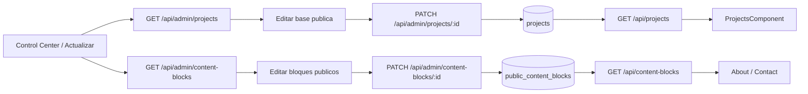

# Public Content Admin Foundation

## Objetivo

Abrir una primera superficie real de administracion para contenido publico sin intentar resolver todo el CMS de una vez.

## Alcance actual

- El panel privado `Actualizar` deja de ser placeholder.
- El backend expone una API admin para listar y editar proyectos publicos.
- El frontend permite editar la base minima de `projects` desde el backoffice.
- El backend expone bloques genericos de contenido publico con `GET /api/content-blocks` y `GET/PATCH /api/admin/content-blocks`.
- `Actualizar` permite editar bloques bilingues para hero/about/contact y referencia de CV sin tocar codigo.
- `About` y `Contact` consumen esos bloques desde backend con fallback local para no romper la UI si la API no responde.
- El detalle rico del portfolio publico todavia sigue viviendo en `frontend/src/app/data/portfolio.data.ts`.

## Flujo funcional

1. Admin autenticado entra a `Control Center`.
2. Abre la superficie `Actualizar`.
3. El frontend consulta `GET /api/admin/projects`.
4. Elige un proyecto existente.
5. Edita base publica: slug, nombre, ano, categoria, resumen, stack, repo, orden, featured, published.
6. El frontend envia `PATCH /api/admin/projects/{id}`.
7. El backend persiste cambios en `projects`.
8. `GET /api/projects` sigue alimentando el portfolio publico con esa base actualizada.
9. El admin tambien puede elegir un bloque publico existente.
10. Edita titulo, cuerpo, items, orden y visibilidad.
11. El frontend envia `PATCH /api/admin/content-blocks/{id}`.
12. `AboutComponent` y `ContactComponent` leen `GET /api/content-blocks` y aplican el contenido publicado por clave e idioma.

## Backend

### Endpoints

- `GET /api/admin/projects`
- `PATCH /api/admin/projects/{id}`
- `GET /api/content-blocks`
- `GET /api/admin/content-blocks`
- `PATCH /api/admin/content-blocks/{id}`

### DTOs nuevos

- `ProjectAdminResponse`
- `ProjectAdminUpdateRequest`
- `PublicContentBlockResponse`
- `PublicContentBlockUpdateRequest`

### Capas tocadas

- `controller/admin/ProjectAdminController`
- `service/ProjectService`
- `service/impl/ProjectServiceImpl`
- `repository/projects/ProjectRepository`
- `mapper/projects/ProjectMapper`
- `controller/PublicContentBlockController`
- `controller/admin/PublicContentBlockAdminController`
- `service/PublicContentBlockService`
- `service/impl/PublicContentBlockServiceImpl`
- `repository/publiccontent/PublicContentBlockRepository`
- `mapper/publiccontent/PublicContentBlockMapper`

### Reglas actuales

- La categoria valida se resuelve contra `ProjectCategory`.
- `stack` se guarda como JSON en `stack_json`.
- La API admin trabaja sobre proyectos existentes; no crea ni elimina todavia.
- La lectura publica sigue filtrando solo `published = true`.
- Los bloques publicos se identifican por `content_key` + `language` y se siembran por Flyway.
- La API admin de bloques edita registros existentes; no crea ni elimina todavia.
- `items_json` guarda listas simples para badges, parrafos, disponibilidad o URL de CV.

## Frontend

### Superficie nueva

- `app-control-center-update`

### Que permite editar

- `slug`
- `name`
- `year`
- `category`
- `summary`
- `stack`
- `repositoryUrl`
- `displayOrder`
- `featured`
- `published`
- bloques publicos: `title`, `body`, `items`, `displayOrder`, `published`

### Limitaciones actuales

- No crea proyectos nuevos.
- No elimina proyectos.
- No crea ni elimina bloques publicos.
- No edita todavia media, descripcion larga, metricas ni secciones ricas.
- El detalle enriquecido del portfolio publico sigue fusionandose localmente en `ProjectsComponent`.
- `Skills` todavia no consume el CMS; queda para una siguiente iteracion para evitar mezclar catalogo tecnico con copy editable.

## Archivos clave

- `backend/src/main/java/com/fernandogferreyra/portfolio/backend/controller/admin/ProjectAdminController.java`
- `backend/src/main/java/com/fernandogferreyra/portfolio/backend/dto/projects/ProjectAdminResponse.java`
- `backend/src/main/java/com/fernandogferreyra/portfolio/backend/dto/projects/ProjectAdminUpdateRequest.java`
- `backend/src/main/java/com/fernandogferreyra/portfolio/backend/service/impl/ProjectServiceImpl.java`
- `frontend/src/app/components/control-center-update/control-center-update.component.ts`
- `frontend/src/app/components/control-center-update/control-center-update.component.html`
- `frontend/src/app/components/control-center-update/control-center-update.component.scss`
- `frontend/src/app/services/project-admin.service.ts`
- `backend/src/main/resources/db/migration/V11__public_content_blocks.sql`
- `backend/src/main/java/com/fernandogferreyra/portfolio/backend/domain/publiccontent/entity/PublicContentBlockEntity.java`
- `backend/src/main/java/com/fernandogferreyra/portfolio/backend/controller/PublicContentBlockController.java`
- `backend/src/main/java/com/fernandogferreyra/portfolio/backend/controller/admin/PublicContentBlockAdminController.java`
- `backend/src/main/java/com/fernandogferreyra/portfolio/backend/security/SecurityConfiguration.java`
- `frontend/src/app/services/public-content.service.ts`
- `frontend/src/app/services/public-content-admin.service.ts`
- `frontend/src/app/components/about/about.component.ts`
- `frontend/src/app/components/contact/contact.component.ts`

## Validacion

- Frontend:
  - `tsc -p frontend/tsconfig.app.json --noEmit`
  - `tsc -p frontend/tsconfig.spec.json --noEmit`
  - `npm test -- --watch=false --browsers=ChromeHeadless` queda bloqueado en WSL si `node_modules` fue instalado desde Windows por binario `@esbuild/win32-x64`.
- Backend:
  - se agrego cobertura en `ApiIntegrationTest` para `GET/PATCH /api/admin/projects`
  - se agrego cobertura en `ApiIntegrationTest` para `GET /api/content-blocks` y `GET/PATCH /api/admin/content-blocks`
  - en este entorno no se pudo ejecutar Maven por falta de `JAVA_HOME`

## Decisiones tecnicas

- Empezar por `projects` porque ya existe persistencia y consumo publico real.
- Mantener esta etapa como base editable minima y no como CMS completo.
- No mover todavia el detalle rico del frontend a backend para no abrir una migracion grande en esta misma etapa.
- Resolver el nuevo alcance con bloques genericos en vez de una tabla por seccion. Esto permite avanzar sobre hero/about/contact/CV sin reabrir una arquitectura vertical ni duplicar logica de render.
- Mantener fallback local en frontend para que el sitio publico siga operativo si el endpoint de contenido no responde.

## Pendientes

- Alta y baja de proyectos.
- Edicion de media, acciones, metricas y contenido rico.
- Conectar `Skills`, credenciales y links directos restantes a la misma base si el patron queda estable.
- Conectar esta superficie con storage documental cuando exista `feature/document-storage-foundation`.
- Asociar documentos subidos a bloques o superficies concretas, especialmente CV.

## Diagrama

