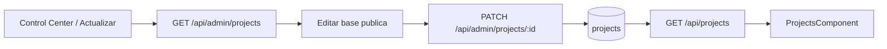

# Public Content Admin Foundation

## Objetivo

Abrir una primera superficie real de administracion para contenido publico sin intentar resolver todo el CMS de una vez.

## Alcance actual

- El panel privado `Actualizar` deja de ser placeholder.
- El backend expone una API admin para listar y editar proyectos publicos.
- El frontend permite editar la base minima de `projects` desde el backoffice.
- El detalle rico del portfolio publico todavia sigue viviendo en `frontend/src/app/data/portfolio.data.ts`.

## Flujo funcional

1. Admin autenticado entra a `Control Center`.
2. Abre la superficie `Actualizar`.
3. El frontend consulta `GET /api/admin/projects`.
4. Elige un proyecto existente.
5. Edita base publica: slug, nombre, ano, categoria, resumen, stack, repo, orden, featured, published.
6. El frontend envia `PATCH /api/admin/projects/{id}`.
7. El backend persiste cambios en `projects`.
8. `GET /api/projects` sigue alimentando el portfolio publico con esa base actualizada.

## Backend

### Endpoints

- `GET /api/admin/projects`
- `PATCH /api/admin/projects/{id}`

### DTOs nuevos

- `ProjectAdminResponse`
- `ProjectAdminUpdateRequest`

### Capas tocadas

- `controller/admin/ProjectAdminController`
- `service/ProjectService`
- `service/impl/ProjectServiceImpl`
- `repository/projects/ProjectRepository`
- `mapper/projects/ProjectMapper`

### Reglas actuales

- La categoria valida se resuelve contra `ProjectCategory`.
- `stack` se guarda como JSON en `stack_json`.
- La API admin trabaja sobre proyectos existentes; no crea ni elimina todavia.
- La lectura publica sigue filtrando solo `published = true`.

## Frontend

### Superficie nueva

- `app-control-center-update`

### Que permite editar

- `slug`
- `name`
- `year`
- `category`
- `summary`
- `stack`
- `repositoryUrl`
- `displayOrder`
- `featured`
- `published`

### Limitaciones actuales

- No crea proyectos nuevos.
- No elimina proyectos.
- No edita todavia media, descripcion larga, metricas ni secciones ricas.
- El detalle enriquecido del portfolio publico sigue fusionandose localmente en `ProjectsComponent`.

## Archivos clave

- `backend/src/main/java/com/fernandogferreyra/portfolio/backend/controller/admin/ProjectAdminController.java`
- `backend/src/main/java/com/fernandogferreyra/portfolio/backend/dto/projects/ProjectAdminResponse.java`
- `backend/src/main/java/com/fernandogferreyra/portfolio/backend/dto/projects/ProjectAdminUpdateRequest.java`
- `backend/src/main/java/com/fernandogferreyra/portfolio/backend/service/impl/ProjectServiceImpl.java`
- `frontend/src/app/components/control-center-update/control-center-update.component.ts`
- `frontend/src/app/components/control-center-update/control-center-update.component.html`
- `frontend/src/app/components/control-center-update/control-center-update.component.scss`
- `frontend/src/app/services/project-admin.service.ts`

## Validacion

- Frontend:
  - `tsc -p frontend/tsconfig.app.json --noEmit`
  - `tsc -p frontend/tsconfig.spec.json --noEmit`
- Backend:
  - se agrego cobertura en `ApiIntegrationTest` para `GET/PATCH /api/admin/projects`
  - en este entorno no se pudo ejecutar Maven por falta de `JAVA_HOME`

## Decisiones tecnicas

- Empezar por `projects` porque ya existe persistencia y consumo publico real.
- Mantener esta etapa como base editable minima y no como CMS completo.
- No mover todavia el detalle rico del frontend a backend para no abrir una migracion grande en esta misma etapa.

## Pendientes

- Alta y baja de proyectos.
- Edicion de media, acciones, metricas y contenido rico.
- Fundacion equivalente para perfil, skills, CV y credenciales.
- Conectar esta superficie con storage documental cuando exista `feature/document-storage-foundation`.

## Diagrama

