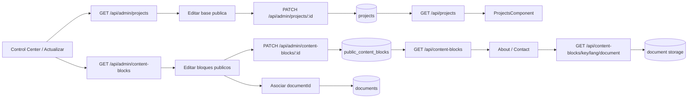

# Public Content Admin Foundation

## Objetivo

Abrir una primera superficie real de administracion para contenido publico sin intentar resolver todo el CMS de una vez.

## Alcance actual

- El panel privado `Actualizar` deja de ser placeholder.
- El backend expone una API admin para listar y editar proyectos publicos.
- El frontend permite editar la base minima de `projects` desde el backoffice.
- El backend expone bloques genericos de contenido publico con `GET /api/content-blocks` y `GET/PATCH /api/admin/content-blocks`.
- `Actualizar` permite editar bloques bilingues para hero/about/contact y referencia de CV sin tocar codigo.
- `About` y `Contact` consumen esos bloques desde backend con fallback local para no romper la UI si la API no responde.
- Los bloques publicos pueden asociarse a un documento existente mediante `documentId`; la descarga publica se expone solo por bloque publicado con `GET /api/content-blocks/{key}/{language}/document`.
- `Contact` consume canales directos editables por bloque: `contact.email`, `contact.phone`, `contact.linkedin`, `contact.github` y `contact.cv`.
- El detalle rico del portfolio publico todavia sigue viviendo en `frontend/src/app/data/portfolio.data.ts`.

## Spec vigente para Contact/CMS/IA

- El bloque `contact.cv` solo controla el canal CV y su documento asociado.
- Email, telefono, LinkedIn y GitHub deben poder editarse sin tocar codigo mediante bloques propios.
- La UI publica no debe mostrar textos de implementacion interna como endpoints, backend real o instrucciones tecnicas.
- El login privado no debe exponer `FERCHUZ` como copy visible ni placeholder.
- En `Actualizar`, Documentos y CMS deben seguir visibles aunque la carga de proyectos quede pendiente o falle.
- La accion IA debe guardar el bloque que se esta editando y traducir el otro idioma asociado por la misma `content_key`.
- `EditMode` visual sobre paginas publicas queda fuera de este bugfix y requiere spec/PR propio.

## Spec vigente para limpieza documental y CV

- Problema: el endpoint publico de CV falla con `Linked document file not found` cuando `contact.cv` referencia metadata de un documento cuyo archivo fisico ya no existe en storage.
- Alcance: permitir que el admin limpie documentos internos obsoletos desde `Actualizar` y que esa baja no deje bloques CMS apuntando a metadata inexistente.
- Alcance: mantener la descarga publica controlada por bloque publicado; no abrir endpoint publico generico de documentos.
- No-goals: no resolver en esta rama el disco persistente de Render ni migrar documentos a almacenamiento externo.
- Criterio de aceptacion: un documento interno puede eliminarse desde el listado admin con confirmacion.
- Criterio de aceptacion: al eliminar un documento, cualquier bloque CMS que lo referencie queda sin `documentId`, por lo que el CV publico deja de apuntar al archivo perdido.
- Criterio de aceptacion: despues de subir un CV nuevo, el admin puede asociarlo a `contact.cv`, guardar el bloque y la descarga publica usa el archivo nuevo.
- Criterio de aceptacion: si una descarga publica encuentra metadata pero falta el archivo fisico, el error sigue siendo explicito y no publica otros documentos.

## Flujo funcional

1. Admin autenticado entra a `Control Center`.
2. Abre la superficie `Actualizar`.
3. El frontend consulta `GET /api/admin/projects`.
4. Elige un proyecto existente.
5. Edita base publica: slug, nombre, ano, categoria, resumen, stack, repo, orden, featured, published.
6. El frontend envia `PATCH /api/admin/projects/{id}`.
7. El backend persiste cambios en `projects`.
8. `GET /api/projects` sigue alimentando el portfolio publico con esa base actualizada.
9. El admin tambien puede elegir un bloque publico existente.
10. Edita titulo, cuerpo, items, orden y visibilidad.
11. El frontend envia `PATCH /api/admin/content-blocks/{id}`.
12. `AboutComponent` y `ContactComponent` leen `GET /api/content-blocks` y aplican el contenido publicado por clave e idioma.
13. Si el bloque tiene `documentId`, el frontend usa `documentUrl` para abrir el archivo asociado.
14. El backend sirve ese archivo solo si el bloque esta publicado y el documento existe.

## Backend

### Endpoints

- `GET /api/admin/projects`
- `PATCH /api/admin/projects/{id}`
- `GET /api/content-blocks`
- `GET /api/content-blocks/{key}/{language}/document`
- `GET /api/admin/content-blocks`
- `PATCH /api/admin/content-blocks/{id}`
- `DELETE /api/admin/documents/{id}`

### DTOs nuevos

- `ProjectAdminResponse`
- `ProjectAdminUpdateRequest`
- `PublicContentBlockResponse`
- `PublicContentBlockUpdateRequest`
- `DocumentDownload`

### Capas tocadas

- `controller/admin/ProjectAdminController`
- `service/ProjectService`
- `service/impl/ProjectServiceImpl`
- `repository/projects/ProjectRepository`
- `mapper/projects/ProjectMapper`
- `controller/PublicContentBlockController`
- `controller/admin/PublicContentBlockAdminController`
- `service/PublicContentBlockService`
- `service/impl/PublicContentBlockServiceImpl`
- `repository/publiccontent/PublicContentBlockRepository`
- `mapper/publiccontent/PublicContentBlockMapper`
- `service/StorageService`
- `service/impl/LocalStorageServiceImpl`

### Reglas actuales

- La categoria valida se resuelve contra `ProjectCategory`.
- `stack` se guarda como JSON en `stack_json`.
- La API admin trabaja sobre proyectos existentes; no crea ni elimina todavia.
- La lectura publica sigue filtrando solo `published = true`.
- Los bloques publicos se identifican por `content_key` + `language` y se siembran por Flyway.
- La API admin de bloques edita registros existentes; no crea ni elimina todavia.
- `items_json` guarda listas simples para badges, parrafos, disponibilidad o URL de CV.
- En canales de contacto, `items_json[0]` representa el valor visible y `items_json[1]` el enlace accionable cuando aplique.
- `document_id` en `public_content_blocks` referencia a `documents(id)` y usa `ON DELETE SET NULL` para no romper bloques si se limpia metadata documental.
- La baja admin de documentos desvincula explicitamente los bloques CMS asociados, borra el archivo fisico si existe y luego elimina la metadata.
- La descarga publica no expone `/api/documents/{id}` generico: se resuelve por bloque publicado para mantener control de superficie.

## Frontend

### Superficie nueva

- `app-control-center-update`

### Que permite editar

- `slug`
- `name`
- `year`
- `category`
- `summary`
- `stack`
- `repositoryUrl`
- `displayOrder`
- `featured`
- `published`
- bloques publicos: `title`, `body`, `items`, `documentId`, `displayOrder`, `published`
- canales de contacto via bloques: email, telefono, LinkedIn, GitHub y CV

### Limitaciones actuales

- No crea proyectos nuevos.
- No elimina proyectos.
- No crea ni elimina bloques publicos.
- No edita todavia media, descripcion larga, metricas ni secciones ricas.
- No abre descarga publica generica para todos los documentos.
- El detalle enriquecido del portfolio publico sigue fusionandose localmente en `ProjectsComponent`.
- `Skills` todavia no consume el CMS; queda para una siguiente iteracion para evitar mezclar catalogo tecnico con copy editable.

## Archivos clave

- `backend/src/main/java/com/fernandogferreyra/portfolio/backend/controller/admin/ProjectAdminController.java`
- `backend/src/main/java/com/fernandogferreyra/portfolio/backend/dto/projects/ProjectAdminResponse.java`
- `backend/src/main/java/com/fernandogferreyra/portfolio/backend/dto/projects/ProjectAdminUpdateRequest.java`
- `backend/src/main/java/com/fernandogferreyra/portfolio/backend/service/impl/ProjectServiceImpl.java`
- `frontend/src/app/components/control-center-update/control-center-update.component.ts`
- `frontend/src/app/components/control-center-update/control-center-update.component.html`
- `frontend/src/app/components/control-center-update/control-center-update.component.scss`
- `frontend/src/app/services/project-admin.service.ts`
- `backend/src/main/resources/db/migration/V11__public_content_blocks.sql`
- `backend/src/main/resources/db/migration/V12__public_content_blocks_document_link.sql`
- `backend/src/main/resources/db/migration/V13__contact_channel_blocks.sql`
- `backend/src/main/java/com/fernandogferreyra/portfolio/backend/domain/documents/model/DocumentDownload.java`
- `backend/src/main/java/com/fernandogferreyra/portfolio/backend/domain/publiccontent/entity/PublicContentBlockEntity.java`
- `backend/src/main/java/com/fernandogferreyra/portfolio/backend/controller/PublicContentBlockController.java`
- `backend/src/main/java/com/fernandogferreyra/portfolio/backend/controller/admin/PublicContentBlockAdminController.java`
- `backend/src/main/java/com/fernandogferreyra/portfolio/backend/security/SecurityConfiguration.java`
- `frontend/src/app/services/public-content.service.ts`
- `frontend/src/app/services/public-content-admin.service.ts`
- `frontend/src/app/components/about/about.component.ts`
- `frontend/src/app/components/contact/contact.component.ts`
- `frontend/src/app/components/contact/contact.component.spec.ts`
- `frontend/src/app/components/control-center-update/control-center-update.component.spec.ts`
- `frontend/src/app/components/admin-login-modal/admin-login-modal.component.spec.ts`
- `frontend/src/app/services/document-admin.service.ts`

## Validacion

- Frontend:
  - `tsc -p frontend/tsconfig.app.json --noEmit`
  - `tsc -p frontend/tsconfig.spec.json --noEmit`
  - specs de regresion para canales CMS de Contact, login sin `FERCHUZ`, resiliencia de carga en `Actualizar` y guardado/traduccion IA.
  - `npm test -- --watch=false --browsers=ChromeHeadless` queda bloqueado en WSL si `node_modules` fue instalado desde Windows por binario `@esbuild/win32-x64`.
- Backend:
  - se agrego cobertura en `ApiIntegrationTest` para `GET/PATCH /api/admin/projects`
  - se agrego cobertura en `ApiIntegrationTest` para `GET /api/content-blocks` y `GET/PATCH /api/admin/content-blocks`
  - se agrego cobertura para asociar un documento al bloque `contact.cv` y descargarlo via `GET /api/content-blocks/contact.cv/es/document`
  - se agrego cobertura para eliminar un documento admin, desvincular bloques CMS asociados y evitar que el CV publico apunte a metadata sin archivo.
  - `mvnw.cmd -DskipTests package` pasa con `JAVA_HOME=C:\Program Files\Java\jdk-17`.
  - `mvnw.cmd test` compila hasta `testCompile`, pero queda bloqueado localmente porque Docker/Testcontainers no esta disponible.

## Decisiones tecnicas

- Empezar por `projects` porque ya existe persistencia y consumo publico real.
- Mantener esta etapa como base editable minima y no como CMS completo.
- No mover todavia el detalle rico del frontend a backend para no abrir una migracion grande en esta misma etapa.
- Resolver el nuevo alcance con bloques genericos en vez de una tabla por seccion. Esto permite avanzar sobre hero/about/contact/CV sin reabrir una arquitectura vertical ni duplicar logica de render.
- Mantener fallback local en frontend para que el sitio publico siga operativo si el endpoint de contenido no responde.
- Asociar documentos por `documentId` dentro del bloque, en vez de guardar URLs publicas hardcodeadas en `items`.
- Exponer descarga por bloque publicado y no por documento global para no abrir acceso publico accidental a todo el storage.

## Pendientes

- Alta y baja de proyectos.
- Edicion de media, acciones, metricas y contenido rico.
- Conectar `Skills`, credenciales y links directos restantes a la misma base si el patron queda estable.
- Implementar `EditMode` visual en una rama separada: toggle protegido por login, estado verde/rojo y edicion contextual por seccion sin alterar la vista visitante cuando este desactivado.
- Mejorar UX de seleccion de documentos con filtros por `purpose`.
- Evaluar descarga controlada con token o auditoria si el contenido deja de ser publico.

## Diagrama

